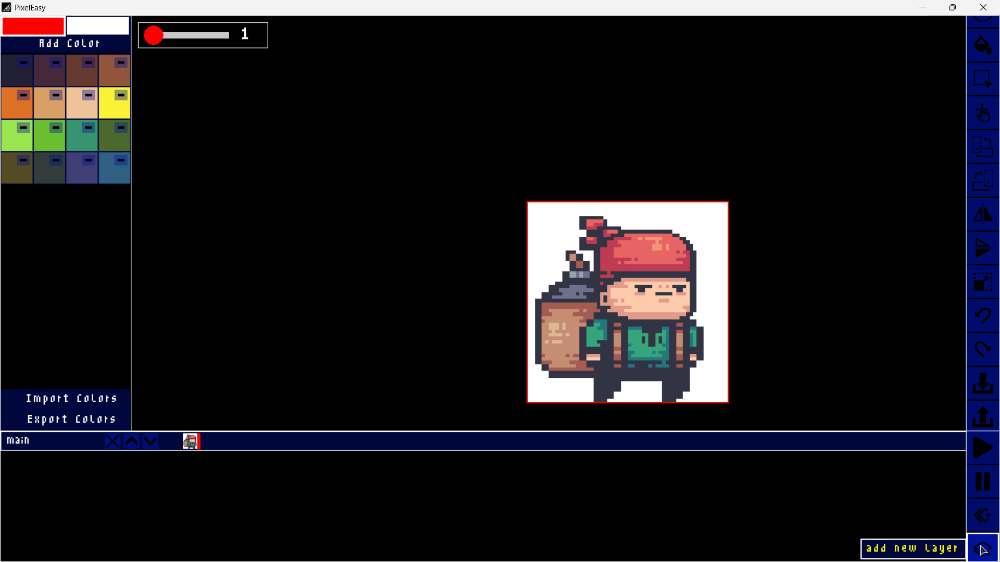

# 🎨 PixelEase

PixelEase is a lightweight pixel art editor built with **Python** and **Pygame**.  
It provides simple yet powerful tools to create, edit, and manage pixel art projects with ease.

---
## Images


---
## ✨ Features
- 🖌️ **Drawing Tools** – Pencil, Eraser, Line, Rectangle, Fill paint.
- 🔄 **Transformations** – Rotate, Flip horizontally, Flip vertically, Selection & Move.
- 🎛️ **Canvas Controls** – Move canvas, Zoom, Export & Import images.
- 🎨 **Color Palette Manager** – Add, remove, import/export custom palettes.
- 💾 **Project Management** – Save & Load pixel art projects.
- ⚙️ **Settings & Customization** – Adjust brush size, background, and more.
---
## 📸 Future Modifications
1. Copy and Paste Functionality
2. Add more brushes for versality

---

## 🕹️ Controls
- **Mouse Left Click** – Select tool / Draw / Pick color.
- **Mouse Scroll** – Scroll through menus & palettes.
- **Keyboard Shortcuts** – (optional, if implemented) for faster workflow.

---

## 🚀 Installation
1. Clone this repository:
   ```bash
   git clone https://github.com/your-username/PixelEase.git
   cd PixelEase
    ```
2. Install dependencies:
```
pip install pygame
```
3. Run the program:
```
python main.py
```
---
## 🛠️ Tech Stack

* Python 3.x
* Pygame
* Tkinter (for file dialogs & color chooser)

---

## 🤝 Contributing

Pull requests are welcome!
If you’d like to add new tools, improve performance, or suggest UI features, feel free to fork and contribute.

---

## 📜 License

MIT License – free to use and modify.
